# Laporan Proyek Machine Learning

## Domain Proyek: Heart Diseases Analytics

Penyakit jantung merupakan penyebab utama kematian di dunia dan sering tidak terdeteksi hingga gejala serius muncul atau terjadi serangan jantung mendadak tanpa peringatan. Kondisi ini disebut sebagai "penyakit tersembunyi" karena gejala awal seperti kelelahan, nyeri dada ringan, atau sesak napas sering disalahartikan sebagai masalah ringan, sehingga banyak penderita tidak memperoleh diagnosis dan pengobatan tepat waktu. Kurangnya kesadaran ini meningkatkan risiko komplikasi serius yang sebenarnya dapat dicegah dengan deteksi dini dan penanganan yang tepat.

Penyakit jantung dikenal sebagai salah satu penyebab utama kematian di dunia, termasuk di Indonesia. Berdasarkan data dari World Health Organization (WHO) tahun 2021, tercatat sekitar 17,8 juta kematian setiap tahunnya disebabkan oleh penyakit jantung, atau setara dengan satu dari tiga kematian secara global. Jumlah kasus penyakit jantung terbaru mencapai 21,2 juta, dengan prevalensi lebih tinggi pada laki-laki dibandingkan perempuan.

Penggunaan teknologi seperti machine learning dan analisis data kesehatan berperan penting dalam deteksi dini penyakit jantung. Dengan menganalisis data klinis dan gaya hidup, algoritma dapat mengenali pola dan faktor risiko secara akurat. Model prediktif ini membantu tenaga medis membuat keputusan lebih cepat dan tepat, serta memungkinkan pemantauan kesehatan secara berkala untuk mencegah kondisi memburuk. Pendekatan ini mendukung sistem kesehatan yang lebih preventif dan berpotensi menurunkan angka kematian akibat penyakit jantung.

**Referensi:**
- [Columbia Asia. (2024). Penyakit Jantung: Ancaman Tersembunyi](https://columbiaasia.co.id/artikel/kesehatan/penyakit-jantung-ancaman-tersembunyi/)
- [Kementerian Kesehatan Republik Indonesia. (2021). Penyakit Jantung, Penyebab Kematian Nomor Satu di Dunia](https://lms.kemkes.go.id/courses/35bff824-437e-4557-b37a-94b128c43333)

## Business Understanding

### Problem Statements

1. Banyak pasien yang berisiko mengalami penyakit jantung tidak terdeteksi secara dini, sehingga penanganan medis menjadi terlambat dan meningkatkan risiko kematian.
2. Faktor risiko penyakit jantung yang kompleks dan beragam membuat proses identifikasi pasien berisiko tinggi menjadi sulit tanpa bantuan teknologi.
3. Minimnya metode atau alat yang efektif untuk melakukan skrining dan deteksi dini risiko penyakit jantung di masyarakat luas sehingga pencegahan belum optimal.

### Goals

1. Mengembangkan model prediktif untuk mengidentifikasi risiko penyakit jantung berdasarkan data klinis dan demografis pasien.
2. Menentukan faktor-faktor klinis dan gaya hidup yang paling berpengaruh dalam meningkatkan risiko penyakit jantung.
3. Memberikan rekomendasi berbasis data kepada tenaga medis untuk mendukung upaya pencegahan dan deteksi dini penyakit jantung.

### Solution Statements

1. Melakukan analisis data eksploratif (EDA) untuk mengidentifikasi pola risiko dan keterkaitan antara variabel klinis seperti tekanan darah, kadar kolesterol, dan jenis nyeri dada dengan kejadian penyakit jantung.
2. Mengimplementasikan serta membandingkan berbagai algoritma klasifikasi, termasuk `Logistic Regression`, `Random Forest`, dan `Gradient Boosting`, untuk mengembangkan model prediksi dengan tingkat akurasi terbaik.
3. Melakukan evaluasi performa setiap model menggunakan metrik F1-Score untuk memastikan keseimbangan antara precision dan recall, serta menggunakan Area Under ROC Curve (AUC-ROC) untuk menilai kemampuan model dalam membedakan antara kasus positif dan negatif secara keseluruhan.

## Data Understanding

Dataset ini berisi informasi klinis dan demografis pasien yang digunakan untuk mendeteksi kemungkinan penyakit jantung. Berikut adalah penjelasan detailnya:

- Jumlah data: 918 baris
- Jumlah fitur: 12 kolom (termasuk target)
- Tipe data: Gabungan numerik (int64, float64) dan kategorikal (object)
- Sumber data: [Heart Failure Prediction Dataset](https://www.kaggle.com/datasets/fedesoriano/heart-failure-prediction)

### Variabel-variabel pada Student Depression Dataset adalah sebagai berikut:

| No. | Nama Kolom       | Deskripsi                                                        |
| --- | ---------------- | ---------------------------------------------------------------- |
| 1   | `Age`            | Usia pasien dalam tahun                                          |
| 2   | `Sex`            | Jenis kelamin pasien (`M` = Laki-laki, `F` = Perempuan)          |
| 3   | `ChestPainType`  | Tipe nyeri dada pasien (`TA`, `ATA`, `NAP`, `ASY`)               |
| 4   | `RestingBP`      | Tekanan darah saat istirahat (mm Hg)                             |
| 5   | `Cholesterol`    | Kadar kolesterol dalam darah (mg/dl)                             |
| 6   | `FastingBS`      | Gula darah puasa > 120 mg/dl (`1` = Ya, `0` = Tidak)             |
| 7   | `RestingECG`     | Hasil elektrokardiogram saat istirahat (`Normal`, `ST`, `LVH`)   |
| 8   | `MaxHR`          | Detak jantung maksimum yang dicapai selama tes                   |
| 9   | `ExerciseAngina` | Apakah mengalami angina saat olahraga (`Y` = Ya, `N` = Tidak)    |
| 10  | `Oldpeak`        | Depresi segmen ST dibandingkan dengan kondisi istirahat          |
| 11  | `ST_Slope`       | Kemiringan segmen ST saat puncak olahraga (`Up`, `Flat`, `Down`) |
| 12  | `HeartDisease`   | Variabel target: status penyakit jantung (`1` = Ya, `0` = Tidak) |

Dari hasil analisis awal deskripsi data, terlihat bahwa data siap untuk tahap selanjutnya.

## Exploratory Data Analysis

#### Analisis Univariat

**1. Distribusi Data Target (HeartDisease)**

 
<image src='images/distribusi_datatarget.png' width= 500/>
 

Distribusi data pada label `HeartDisease` adalah cukup imbalance (55.3% vs 44.7%). Hal ini harus diperhatikan saat pelatihan model, agar tidak menghasilkan prediksi yang berat sebelah. Metrik evaluasi yang tepat dan teknik penyeimbangan data seperti oversampling pada data train (saat setelah membagi data) bisa membantu mengatasi masalah ini.

**2. Distribusi Data Kategorikal**
 
<image src='images/barchart_cat.png' width= 500/>
 

Distribusi data kategorikal menunjukkan ketimpangan pada beberapa fitur, seperti `ChestPainType` dan `ST_Slope`. Ketimpangan ini dapat memengaruhi kinerja model, sehingga perlu penanganan khusus. Salah satu cara efektif adalah menggunakan **One-Hot Encoding**, yang mengubah setiap kategori menjadi kolom biner tanpa memberi makna urutan. Pendekatan ini membantu model memahami setiap kategori secara adil dan mencegah bias terhadap kategori mayoritas.

**3. Distribusi Data Numerik**
 
<image src='images/Histogram_num.png' width= 500/>
<image src='images/Boxplot_num.png' width= 500/>
  
Dari gambar histogram menggambarkan sebaran nilai dan frekuensi kemunculannya. Sebagian besar distribusi menunjukkan bentuk mendekati normal (seperti `Age` dan `MaxHR`), namun beberapa memiliki sebaran yang condong atau outlier ekstrem, seperti `Cholesterol` dan `Oldpeak`

Boxplot menunjukkan bahwa sebagian besar fitur memiliki outlier, terutama pada RestingBP, Cholesterol, dan Oldpeak, sedangkan Age dan MaxHR memiliki sebaran yang relatif normal. Fitur FastingBS didominasi oleh nilai 0 dan minim variasi, sehingga dianggap tidak informatif dan akhirnya dihapus karena berpotensi tidak berkontribusi signifikan terhadap performa model.

**4. Matriks korelasi kolom numerik**
 
<image src='images/Correlation_matrix.png' width= 500/>
  
Berdasarkan korelasi antar fitur numerik, tidak ditemukan fitur yang redundant dalam dataset ini. Nilai korelasi antar fitur mayoritas rendah, di bawah 0.3, sehingga setiap fitur memberikan informasi yang unik dan layak dipertahankan untuk analisis atau pemodelan.

#### Analisis Multivariat
## Kategorikal
**1. Sex vs HeartDisease**
 
<image src='images/Sex vs HeartDisease.png' width= 500/>
 
- Pria (M) cenderung memiliki jumlah kasus penyakit jantung (HeartDisease = Yes) sebesar 90.2% yang jauh lebih banyak dibandingkan wanita (F) yang sebesar 9.8%.
- Wanita memiliki jumlah kasus negatif sebesar 34.9% (tidak ada penyakit jantung) yang lebih tinggi dibandingkan kasus positif yang sebesar 9.8%.

Indikasi: Jenis kelamin pria memiliki risiko lebih tinggi terkena penyakit jantung.

**2. ChestPainType vs HeartDisease**
 
<image src='images/ChestPainType vs HeartDisease.png' width= 500/>
 
- Tipe nyeri dada ASY (Asymptomatic) memiliki jumlah kasus penyakit jantung yang sangat tinggi dibandingkan tipe lainnya.
- Tipe ATA (Atypical angina), NAP (Non-anginal pain), dan TA (Typical angina) cenderung lebih banyak ditemukan pada pasien tanpa penyakit jantung.

Indikasi: Nyeri dada tipe Asymptomatic berpotensi menjadi indikator kuat penyakit jantung.

**3. RestingECG vs HeartDisease**
 
<image src='images/RestingECG vs HeartDisease.png' width= 500/>
 
- Pada kategori Normal, distribusi pasien dengan dan tanpa penyakit jantung tampak seimbang.
- Kategori ST dan LVH lebih banyak ditemukan pada pasien dengan penyakit jantung.

Indikasi: Abnormalitas pada Resting ECG (ST, LVH) bisa mengindikasikan adanya penyakit jantung.

**4. ExerciseAngina vs HeartDisease**
 
<image src='images/ExerciseAngina vs HeartDisease.png' width= 500/>
  
- Pasien dengan ExerciseAngina = Y (ya) cenderung lebih banyak yang positif penyakit jantung.
- Sebaliknya, pasien tanpa exercise angina (N) mayoritas tidak memiliki penyakit jantung.

Indikasi: Exercise angina mungkin menjadi tanda yang cukup kuat adanya penyakit jantung.

**5. ST_Slope vs HeartDisease**
 
<image src='images/ST_Slope vs HeartDisease.png' width= 500/>
  
- Kategori Flat pada ST slope tampak terkait dengan jumlah kasus penyakit jantung yang tinggi.
- Kategori Up lebih sering ditemukan pada pasien tanpa penyakit jantung.
- Kategori Down juga lebih banyak pada pasien dengan penyakit jantung, meskipun jumlahnya lebih kecil dari Flat.

Indikasi: ST slope Flat dan Down bisa menjadi indikator risiko penyakit jantung yang lebih tinggi dibandingkan slope Up.

## Numerikal
**1. Age vs HeartDisease**
 
<image src='images/Distribution of Age by HeartDisease.png' width= 500/>
  
- Distribusi: Terlihat pergeseran ke kanan pada grup penderita HeartDisease = Yes, artinya penderita cenderung lebih tua dibandingkan yang tidak.
- Rata-rata:
  - All: 53.51
  - No: 50.55
  - Yes: 54.90

Pengaruh: Umur yang lebih tua meningkatkan kemungkinan terkena penyakit jantung, karena risiko penyakit jantung memang meningkat seiring bertambahnya usia.

**2. RestingBP vs HeartDisease**
 
<image src='images/Distribution of RestingBP by HeartDisease.png' width= 500/>
  
- Distribusi: Kedua kelompok (HeartDisease = No dan Yes) memiliki distribusi yang mirip, namun terdapat sedikit pergeseran ke kanan pada kelompok HeartDisease = Yes, yang menunjukkan tekanan darah lebih tinggi.
- Rata-rata:
  - All: 132.40
  - No: 130.18
  - Yes: 134.19

Pengaruh: enderita penyakit jantung cenderung memiliki tekanan darah istirahat yang sedikit lebih tinggi. Meskipun perbedaannya tidak terlalu besar, tekanan darah yang meningkat dapat menjadi faktor risiko tambahan terhadap penyakit jantung, terutama jika dikombinasikan dengan faktor risiko lainnya.

**3. Cholesterol vs HeartDisease**
 
<image src='images/Distribution of Cholesterol by HeartDisease.png' width= 500/>
  
- Distribusi: Terlihat bahwa kelompok HeartDisease = No memiliki distribusi kolesterol yang lebih tinggi dibandingkan dengan kelompok HeartDisease = Yes, yang cukup mengejutkan karena bertentangan dengan asumsi umum.
- Rata-rata:
  - All: 198.80
  - No: 227.12
  - Yes: 175.94

Pengaruh: Secara mengejutkan, kolesterol rata-rata pada penderita penyakit jantung justru lebih rendah. Hal ini bisa disebabkan oleh berbagai faktor, seperti efek pengobatan yang menurunkan kolesterol, gaya hidup setelah diagnosis, atau distribusi data yang tidak merata. Oleh karena itu, kolesterol dalam dataset ini mungkin kurang representatif sebagai indikator tunggal untuk mendeteksi penyakit jantung.

**4. MaxHR vs HeartDisease**
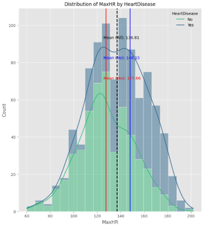
- Distribusi: Distribusi menunjukkan bahwa kelompok HeartDisease = No memiliki detak jantung maksimum yang lebih tinggi, sedangkan kelompok HeartDisease = Yes cenderung memiliki MaxHR yang lebih rendah.
- Rata-rata:
  - All: 136.81
  - No: 148.15
  - Yes: 127.66

Pengaruh: Penderita penyakit jantung cenderung tidak mampu mencapai detak jantung maksimum yang tinggi saat beraktivitas fisik, yang bisa menjadi indikasi keterbatasan fungsi jantung. MaxHR yang lebih rendah merupakan sinyal penting adanya potensi gangguan jantung, sehingga fitur ini cukup signifikan dalam membedakan antara penderita dan non-penderita.

**5. Oldpeak vs HeartDisease**
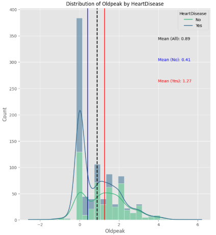
- Distribusi: Sangat berbeda antar grup. Grup HeartDisease = Yes punya distribusi lebih menyebar ke kanan (nilai oldpeak lebih tinggi).
- Rata-rata:
  - All: 0.89
  - No: 0.41
  - Yes: 1.27

Pengaruh: Oldpeak tinggi mengindikasikan abnormalitas EKG akibat iskemia (kurangnya aliran darah ke jantung), sehingga sangat erat kaitannya dengan penyakit jantung. Ini adalah salah satu fitur yang paling membedakan kedua grup.

## Data Preparation

adalah proses mengubah dan mengolah data mentah agar siap digunakan dalam tahap pemodelan. Proses ini meliputi pembersihan, transformasi, dan penyesuaian format data agar sesuai dengan kebutuhan algoritma yang akan diterapkan. Dengan persiapan data yang tepat, model dapat belajar secara efektif dan menghasilkan prediksi yang akurat. Berikut adalah beberapa tahapannya:

### 1. Menghapus Kolom yang Tidak digunakan

Pertama yang akan dilakukan yaitu menghapus kolom `FastingBS` yang sudah tidak digunakan lagi untuk tahap yang lebih lanjut.
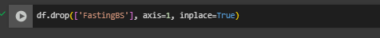

### 2. Menangani Missing Values

Pada dataset terlihat tidak terdapat missing value. 
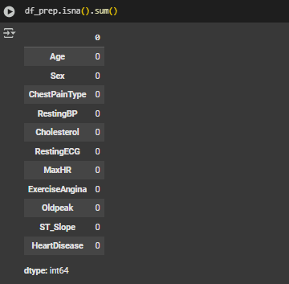 

### 3. Menangani Data Duplikat

Pada dataset terlihat tidak terdapat data duplikat. 

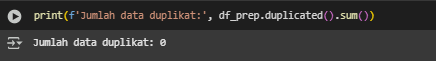

### 4. Menghapus Outlier Values

Untuk menangani outlier, dilakukan penghapusan outlier pada kolom `RestingBP`, `Cholesterol`, `MaxHR` dan `Oldpeak` menggunakan metode IQR (Interquartile Range). Metode ini diterapkan untuk menghapus data yang berada di luar rentang batas bawah dan batas atas yang telah ditetapkan, sehingga menghasilkan data yang lebih rapi dan menggambarkan kondisi sebenarnya dengan lebih baik.
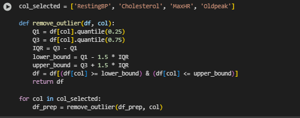

### 5. Encoding Fitur Kategori

Di tahap ini, data kategori berupa teks atau label diubah menjadi format angka supaya bisa diproses oleh algoritma machine learning. Proses encoding pada fitur kategorikal dilakukan dalam dua tahap:

1. **Label Encoding**: mengubah nilai kategori menjadi bilangan bulat (seperti `0` dan `1`) pada variabel yang hanya memiliki dua kelas, berikut adalah kolomnya:
   - `Sex`
   - `ExerciseAngina`

2. One Hot Encoding: mengonversi setiap kategori menjadi kolom-kolom biner yang terpisah, digunakan untuk data kategori yang tidak memiliki urutan, berikut adalah kolomnya:
   - `ChestPainType`
   - `RestingECG`
   - `ST_Slope`

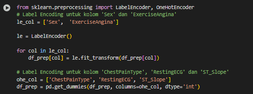 

### 6. Train-Test-Split

Data dibagi dengan rasio 80:20, di mana 80% dari data digunakan sebagai data pelatihan (training) untuk membangun dan mengoptimalkan model, sedangkan 20% sisanya dialokasikan sebagai data pengujian (testing). Pembagian ini bertujuan untuk memastikan proses evaluasi model berjalan secara objektif dan hasil pengujian mencerminkan kemampuan model dalam menghadapi data baru yang belum pernah dilihat sebelumnya. Dengan demikian, performa model dapat diukur secara akurat dan generalisasi model terhadap data nyata dapat dipantau.
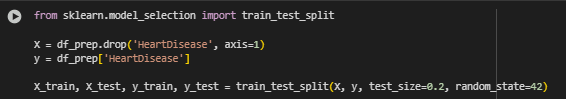 

### 7. Transformasi Values

Dilakukan proses scaling menggunakan MinMaxScaler untuk menormalkan rentang nilai pada setiap fitur. Dengan metode ini, semua fitur diubah ke dalam skala yang seragam, biasanya antara 0 hingga 1, sehingga tidak ada fitur yang memiliki pengaruh berlebihan akibat perbedaan skala nilai. Hal ini membantu algoritma machine learning bekerja lebih efektif dan menghasilkan model yang lebih stabil.
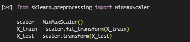 

### 8. Menangani Data Imbalance

Untuk mengatasi ketidakseimbangan kelas pada data latih, digunakan teknik SMOTE (Synthetic Minority Over-sampling Technique) yang menambahkan data sintetis pada kelas yang jumlahnya lebih sedikit. Selain itu, pengujian juga dilakukan pada data tanpa penerapan SMOTE guna membandingkan tingkat akurasi dan menilai sejauh mana metode ini efektif dalam meningkatkan performa model.
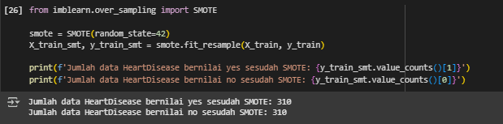 

## Modeling
### 1. Random Forest
Random Forest adalah algoritma ensemble learning yang membentuk banyak pohon keputusan (decision tree) dan menggabungkan hasilnya untuk meningkatkan akurasi dan mengurangi overfitting. Setiap pohon dilatih pada subset acak dari data dan fitur, sehingga menciptakan model yang lebih stabil dan tahan terhadap noise.

**Kelebihan:**
* Dapat menangani data numerik maupun kategorikal.
* Kurang rentan terhadap overfitting dibanding single decision tree.
* Memberikan estimasi pentingnya fitur (feature importance).

**Kekurangan:**
* Kurang interpretatif dibanding model yang lebih sederhana.
* Membutuhkan lebih banyak waktu dan sumber daya dibanding algoritma dasar.
* Tidak secepat model linear pada dataset besar.

### 2. Gradient Boosting
Gradient Boosting adalah algoritma ensemble yang membangun model secara bertahap, di mana setiap model baru mencoba memperbaiki kesalahan dari model sebelumnya. Model ini sangat kuat karena mampu menangani data kompleks dan non-linier, serta memiliki performa tinggi pada banyak tugas klasifikasi.

**Kelebihan:**
* Performa tinggi dalam banyak kasus klasifikasi dan regresi.
* Mampu menangkap hubungan non-linier antar fitur.
* Dapat dikombinasikan dengan teknik regularisasi untuk mengurangi overfitting.

**Kekurangan:**
* Proses pelatihan relatif lambat.
* Memerlukan tuning hyperparameter yang cermat untuk hasil optimal.
* Lebih kompleks dan sulit untuk diinterpretasikan dibanding model sederhana.

### 3. K-Nearest Neighbors (KNN)
K-Nearest Neighbors adalah algoritma machine learning berbasis instance-based learning yang digunakan untuk tugas klasifikasi maupun regresi. Dalam klasifikasi, KNN menentukan kelas suatu data baru berdasarkan mayoritas kelas dari k tetangga terdekatnya dalam ruang fitur. Jarak umum yang digunakan untuk menentukan kedekatan adalah Euclidean distance.
**Kelebihan:**
* Sederhana dan mudah dipahami.
* Tidak memerlukan proses pelatihan (lazy learning).
* Dapat bekerja baik untuk data dengan distribusi non-linier.

**Kekurangan:**
* Waktu prediksi bisa lambat jika data besar (karena menghitung jarak ke semua titik).
* Sensitif terhadap fitur yang memiliki skala berbeda.
* Kinerja menurun jika data mengandung banyak noise atau fitur yang tidak relevan.

Pada project kali ini akan dilakukan percobaan terhadap beberapa algoritma machine learning yaitu:
**Tabel Parameter Model**
| Nama Model             | Kode Pemanggilan                              | Parameter yang Ditentukan |
| ---------------------- | --------------------------------------------- | ------------------------- |
| Logistic Regression    | `LogisticRegression(random_state=42)`         | hanya `random_state`      |
| Decision Tree          | `DecisionTreeClassifier(random_state=42)`     | hanya `random_state`      |
| Random Forest          | `RandomForestClassifier(random_state=42)`     | hanya `random_state`      |
| AdaBoost               | `AdaBoostClassifier(random_state=42)`         | hanya `random_state`      |
| Gradient Boosting      | `GradientBoostingClassifier(random_state=42)` | hanya `random_state`      |
| Support Vector Machine | `SVC(random_state=42)`                        | hanya `random_state`      |
| Naive Bayes            | `GaussianNB()`                                | semua parameter default   |
| K-Nearest Neighbors    | `KNeighborsClassifier()`                      | semua parameter default   |
| XGBoost                | `XGBClassifier(random_state=42)`              | hanya `random_state`      |

### Performa model sebelum menggunakan SMOTE (Synthetic Minority Oversampling Technique)
| Model                  | Acc Train | Acc Test | Prec Train | Prec Test | Rec Train | Rec Test | F1 Train | F1 Test | ROC Train | ROC Test |
| ---------------------- | --------- | -------- | ---------- | --------- | --------- | -------- | -------- | ------- | --------- | -------- |
| Logistic Regression    | 0.859     | 0.887    | 0.835      | 0.892     | 0.852     | 0.892    | 0.844    | 0.892   | 0.858     | 0.886    |
| Decision Tree          | 1.000     | 0.809    | 1.000      | 0.841     | 1.000     | 0.784    | 1.000    | 0.811   | 1.000     | 0.810    |
| Random Forest          | 1.000     | 0.929    | 1.000      | 0.910     | 1.000     | 0.959    | 1.000    | 0.934   | 1.000     | 0.927    |
| AdaBoost               | 0.868     | 0.858    | 0.861      | 0.886     | 0.840     | 0.838    | 0.850    | 0.861   | 0.865     | 0.859    |
| Gradient Boosting      | 0.964     | 0.887    | 0.953      | 0.892     | 0.968     | 0.892    | 0.960    | 0.892   | 0.965     | 0.886    |
| Support Vector Machine | 0.879     | 0.894    | 0.845      | 0.864     | 0.892     | 0.946    | 0.868    | 0.903   | 0.880     | 0.891    |
| Naive Bayes            | 0.850     | 0.879    | 0.829      | 0.861     | 0.836     | 0.919    | 0.833    | 0.889   | 0.849     | 0.877    |
| K-Nearest Neighbors    | 0.875     | 0.894    | 0.844      | 0.873     | 0.884     | 0.932    | 0.863    | 0.902   | 0.876     | 0.892    |
| XGBoost                | 1.000     | 0.865    | 1.000      | 0.867     | 1.000     | 0.878    | 1.000    | 0.872   | 1.000     | 0.865    |

### Performa model setelah menggunakan SMOTE (Synthetic Minority Oversampling Technique)
| Model                  | Acc Train | Acc Test | Prec Train | Prec Test | Rec Train | Rec Test | F1 Train | F1 Test | ROC Train | ROC Test |
| ---------------------- | --------- | -------- | ---------- | --------- | --------- | -------- | -------- | ------- | --------- | -------- |
| Logistic Regression    | 0.860     | 0.872    | 0.852      | 0.859     | 0.871     | 0.905    | 0.861    | 0.882   | 0.860     | 0.871    |
| Decision Tree          | 1.000     | 0.823    | 1.000      | 0.845     | 1.000     | 0.811    | 1.000    | 0.828   | 1.000     | 0.823    |
| Random Forest          | 1.000     | 0.922    | 1.000      | 0.909     | 1.000     | 0.946    | 1.000    | 0.927   | 1.000     | 0.921    |
| AdaBoost               | 0.874     | 0.851    | 0.872      | 0.853     | 0.877     | 0.865    | 0.875    | 0.859   | 0.874     | 0.850    |
| Gradient Boosting      | 0.966     | 0.915    | 0.956      | 0.908     | 0.977     | 0.932    | 0.967    | 0.920   | 0.966     | 0.914    |
| Support Vector Machine | 0.874     | 0.887    | 0.856      | 0.854     | 0.900     | 0.946    | 0.877    | 0.897   | 0.874     | 0.883    |
| Naive Bayes            | 0.852     | 0.872    | 0.861      | 0.850     | 0.839     | 0.919    | 0.850    | 0.883   | 0.852     | 0.870    |
| K-Nearest Neighbors    | 0.889     | 0.901    | 0.869      | 0.866     | 0.916     | 0.959    | 0.892    | 0.910   | 0.889     | 0.898    |
| XGBoost                | 1.000     | 0.872    | 1.000      | 0.878     | 1.000     | 0.878    | 1.000    | 0.878   | 1.000     | 0.872    |

Setelah di telusuri bahwa algoritma yang dipilh untuk melakukan tahap hyperparameter tuning yaitu `Random Forest`, `Gradient Boosting`, dan `K-Nearest Neighbors` maka dari itu berikut adalah parameter yang saya gunakan pada setiap algoritma untuk hyperparameter tuning:

### 1. Random Forest
Berikut adalah tabel penjelasan parameter yang digunakan dalam hyperparameter tuning `RandomForestClassifier` menggunakan `RandomizedSearchCV`:

| **Parameter**       | **Tipe**            | **Deskripsi**                                                                   |
| ------------------- | ------------------- | ------------------------------------------------------------------------------- |
| `n_estimators`      | `randint(100, 500)` | Jumlah pohon dalam hutan (semakin banyak, semakin akurat tetapi lebih lambat).  |
| `max_depth`         | `randint(3, 30)`    | Kedalaman maksimum setiap pohon. Mengontrol kompleksitas model.                 |
| `min_samples_split` | `randint(2, 20)`    | Minimum jumlah sampel yang dibutuhkan untuk membagi node.                       |
| `min_samples_leaf`  | `randint(1, 20)`    | Minimum jumlah sampel yang diperlukan untuk berada di daun (leaf).              |
| `max_features`      | `['sqrt', 'log2']`  | Jumlah fitur yang dipertimbangkan untuk setiap split (√jumlah fitur atau log₂). |
| `bootstrap`         | `[True, False]`     | Jika `True`, gunakan sampling bootstrap saat membuat pohon.                     |

### Penjelasan tambahan:

* `RandomizedSearchCV` mencoba kombinasi acak dari parameter-parameter di atas sebanyak `n_iter=50`.
* `scoring='roc_auc'`: Model dipilih berdasarkan skor AUC pada cross-validation.
* `cv=5`: Menggunakan 5-fold cross-validation untuk validasi.
* `n_jobs=-1`: Gunakan seluruh core CPU untuk mempercepat proses.
* `verbose=1`: Menampilkan progress selama tuning.

Berikut adalah tabel hasil evaluasi model **Random Forest (Tuned)**:

| model                 | acc_train | acc_test | prec_train | prec_test | rec_train | rec_test | f1_train |  f1_test | roc_train | roc_test |
| --------------------- | --------- | -------- | ---------- | --------- | --------- | -------- | -------- | -------- | --------- | -------- |
| Random Forest (Tuned) | 0.901786  | 0.907801 | 0.888446   | 0.876543  | 0.892     | 0.959459 | 0.890220 | 0.916129 | 0.900839  | 0.905103 |

### 2. Gradient Boosting
Berikut adalah penjelasan parameter hyperparameter tuning yang digunakan pada algoritma **Gradient Boosting** menggunakan `RandomizedSearchCV`:

| Parameter           | Deskripsi                                                                | Tipe Distribusi | Rentang/Pilihan               |
| ------------------- | ------------------------------------------------------------------------ | --------------- | ----------------------------- |
| `n_estimators`      | Jumlah pohon keputusan (trees) yang dibangun                             | `randint`       | 100 sampai 500                |
| `learning_rate`     | Kecepatan pembelajaran, bobot pengurangan kontribusi setiap pohon        | `uniform`       | 0.01 sampai 0.31 (0.01 + 0.3) |
| `max_depth`         | Kedalaman maksimal tiap pohon keputusan                                  | `randint`       | 3 sampai 15                   |
| `min_samples_split` | Jumlah minimal sampel yang dibutuhkan untuk membagi node                 | `randint`       | 2 sampai 20                   |
| `min_samples_leaf`  | Jumlah minimal sampel pada daun pohon                                    | `randint`       | 1 sampai 20                   |
| `subsample`         | Proporsi sampel acak yang digunakan untuk membangun tiap pohon (bagging) | `uniform`       | 0.6 sampai 1.0 (0.6 + 0.4)    |

### Penjelasan tambahan:

* `RandomizedSearchCV` mencoba kombinasi acak dari parameter-parameter di atas sebanyak `n_iter=50`.
* `scoring='roc_auc'`: Model dipilih berdasarkan skor AUC pada cross-validation.
* `cv=5`: Menggunakan 5-fold cross-validation untuk validasi.
* `n_jobs=-1`: Gunakan seluruh core CPU untuk mempercepat proses.
* `verbose=1`: Menampilkan progress selama tuning.

Berikut adalah tabel hasil evaluasi model **Gradient Boosting (Tuned)**:

| model                     |  acc_train |  acc_test | prec_train  |  prec_test |  rec_train |  rec_test |  f1_train |  f1_test |  roc_train |  roc_test |
| ------------------------- | ---------- | --------- | ----------- | ---------- | ---------- | --------- | --------- | -------- | ---------- | --------- |
| Gradient Boosting (Tuned) | 0.941071   | 0.914894  | 0.92549     | 0.918919   | 0.944      | 0.918919  | 0.934653  | 0.918919 | 0.941355   | 0.914683  |

### 3. K-Nearest Neighbors
Berikut adalah penjelasan parameter hyperparameter tuning untuk algoritma **K-Nearest Neighbors (KNN)** menggunakan `RandomizedSearchCV`:

| Parameter     | Deskripsi                                                                            | Nilai / Rentang yang Dicari                                          |
| ------------- | ------------------------------------------------------------------------------------ | -------------------------------------------------------------------- |
| `n_neighbors` | Jumlah tetangga terdekat yang digunakan untuk menentukan kelas data baru             | Integer antara 3 sampai 30                                           |
| `weights`     | Bobot yang diberikan pada tetangga saat voting:                                      | `'uniform'` (bobot sama) atau `'distance'` (bobot berdasarkan jarak) |
| `p`           | Parameter untuk menentukan jenis jarak yang digunakan:                               | `1` untuk Manhattan distance, `2` untuk Euclidean distance           |
| `leaf_size`   | Ukuran daun pada pohon pencarian yang digunakan untuk mempercepat pencarian tetangga | Integer antara 10 sampai 50                                          |

### Penjelasan tambahan:

* `RandomizedSearchCV` mencoba kombinasi acak dari parameter-parameter di atas sebanyak `n_iter=50`.
* `scoring='roc_auc'`: Model dipilih berdasarkan skor AUC pada cross-validation.
* `cv=5`: Menggunakan 5-fold cross-validation untuk validasi.
* `n_jobs=-1`: Gunakan seluruh core CPU untuk mempercepat proses.
* `verbose=1`: Menampilkan progress selama tuning.

Berikut adalah tabel hasil evaluasi model **K-Nearest Neighbors (Tuned)**:

| model                       |  acc_train | acc_test  |  prec_train |  prec_test |  rec_train |  rec_test |  f1_train |  f1_test |  roc_train |  roc_test |
| --------------------------- | ---------- | --------- | ----------- | ---------- | ---------- | --------- | --------- | -------- | ---------- | --------- |
| K-Nearest Neighbors (Tuned) | 1.000      | 0.9078    | 1.000       | 0.8861     | 1.000      | 0.9459    | 1.000     | 0.9150   | 1.000      | 0.9058    |

## Evaluation

Untuk mengevaluasi kinerja model dalam mendeteksi risiko penyakit jantung, digunakan beberapa metrik evaluasi, yaitu recall, F1-score, dan ROC (Receiver Operating Characteristic). Penggunaan metrik ini didasarkan pada karakteristik masalah yang memiliki distribusi kelas tidak seimbang serta potensi dampak serius jika terjadi kesalahan klasifikasi. Recall digunakan untuk menilai kemampuan model dalam mengidentifikasi seluruh kasus positif (individu yang berisiko penyakit jantung), F1-score memberikan keseimbangan antara presisi dan recall, sementara ROC membantu mengevaluasi performa model pada berbagai ambang batas klasifikasi.

### Hasil perbandingan model sebelum dan sesudah dilakukan hyperparameter tuning
| model                               | acc_train | acc_test | prec_train | prec_test | rec_train | rec_test | f1_train | f1_test | roc_train | roc_test |
| ----------------------------------- | --------- | -------- | ---------- | --------- | --------- | -------- | -------- | ------- | --------- | -------- |
| Random Forest (Before Tuning)       | 1.000     | 0.929    | 1.000      | 0.910     | 1.000     | 0.959    | 1.000    | 0.934   | 1.000     | 0.927    |
| Random Forest (Tuned)               | 0.902     | 0.908    | 0.888      | 0.877     | 0.892     | 0.959    | 0.890    | 0.916   | 0.901     | 0.905    |
| Gradient Boosting (Before Tuning)   | 0.964     | 0.887    | 0.953      | 0.892     | 0.968     | 0.892    | 0.960    | 0.892   | 0.965     | 0.886    |
| Gradient Boosting (Tuned)           | 0.941     | 0.915    | 0.925      | 0.919     | 0.944     | 0.919    | 0.935    | 0.919   | 0.941     | 0.915    |
| K-Nearest Neighbors (Before Tuning) | 0.875     | 0.894    | 0.844      | 0.873     | 0.884     | 0.932    | 0.863    | 0.902   | 0.876     | 0.892    |
| K-Nearest Neighbors (Tuned)         | 1.000     | 0.908    | 1.000      | 0.886     | 1.000     | 0.946    | 1.000    | 0.915   | 1.000     | 0.906    |

### F1 Score

**F1 Score** adalah metrik yang menggabungkan precision dan recall. F1-score sangat berguna ketika kita menghadapi ketidakseimbangan kelas dalam dataset. Nilai F1-score adalah rata-rata harmonis antara precision dan recall, memberikan keseimbangan antara kedua metrik tersebut. F1-score memberikan keseimbangan antara precision dan recall, yang berguna ketika keduanya sama pentingnya, dengan rumus:

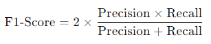 

di mana:
- **Precision**: Precision adalah metrik yang lebih spesifik daripada akurasi untuk mengukur salah-satu label sebagai entitas terpisah. Precision mengukur: dari semua prediksi pada label tertentu (dalam hal ini label positif), berapa persen yang prediksinya benar. Atau dalam bahasa yang lebih teknis, precision adalah rasio antara prediksi positif yang benar (true positive) dengan total prediksi positif (baik yang benar maupun salah).  
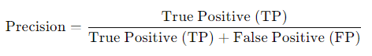 
- **Recall**: Recall mengukur seberapa banyak kasus positif dari semua data yang aktualnya beneran positif. Metrik ini penting ketika kita ingin meminimalkan kesalahan negatif (false negative), seperti pada deteksi penyakit di mana kita tidak ingin ada pasien yang sakit tetapi diklasifikasikan sebagai sehat. Secara teknis dalam confusion matrix, recall adalah rasio antara prediksi positif yang benar dengan total jumlah data yang sebenarnya positif.
 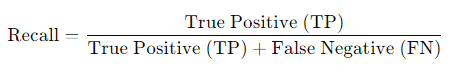 

**ROC (Receiver Operating Characteristic)** adalah grafik yang digunakan untuk mengevaluasi kinerja model klasifikasi biner. Grafik ini menggambarkan kemampuan model dalam membedakan antara kelas positif dan negatif pada berbagai threshold (ambang batas) probabilitas.

Penggunaan metrik recall sangat penting untuk memastikan model mampu menangkap sebanyak mungkin kasus positif, sedangkan F1 Score sangat sesuai untuk menjaga keseimbangan antara False Positive dan False Negative, terutama dalam deteksi risiko penyakit jantung. Berdasarkan hasil evaluasi, model Gradient Boosting mencapai recall sebesar 0,92, F1 Score sebesar 0,92, dan ROC AUC sebesar 0,91, yang menunjukkan bahwa model ini memiliki kepekaan tinggi dalam mendeteksi kasus positif sekaligus performa klasifikasi yang kuat dibandingkan model lain.

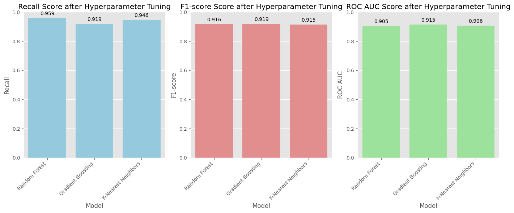 

## Referensi
1. Columbia Asia. (2024). Penyakit Jantung: Ancaman Tersembunyi. Retrieved from: https://columbiaasia.co.id/artikel/kesehatan/penyakit-jantung-ancaman-tersembunyi/
2. Kementerian Kesehatan Republik Indonesia. (2021). Penyakit Jantung, Penyebab Kematian Nomor Satu di Dunia. Retrieved from: https://lms.kemkes.go.id/courses/35bff824-437e-4557-b37a-94b128c43333
3. https://haloryan.com/blog/apa-itu-akurasi-precision-recall-f1-score-rumus-cara-menghitungnya
4. https://www.haloryan.com/blog/roc-auc-pengertian-fungsi-dan-cara-menggunakannya-dalam-machine-learning
